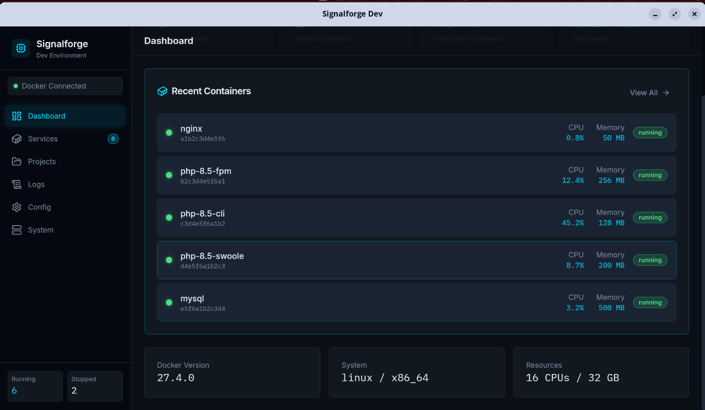

<p align="center">
  
</p>

<h1 align="center">Signalforge Dev</h1>

<p align="center">
  <strong>A modern, cross-platform Docker development environment manager</strong>
</p>

<p align="center">
  
  
  
  
</p>

<p align="center">
  Built to replace XAMPP and be better than Docker Desktop.<br>
  Beautiful dark UI with the Signalforge aesthetic.
</p>

---

## Features

- **Dashboard** — Real-time overview of running/stopped containers, CPU & memory usage
- **Services** — Start, stop, and restart containers with one click
- **Container Stats** — Live CPU and memory metrics for each container
- **System Info** — Docker version, system resources, and architecture details
- **Projects** — Manage multiple docker-compose projects *(coming soon)*
- **Logs** — Real-time log streaming with search *(coming soon)*
- **Config Editor** — Edit docker-compose.yml with Monaco Editor *(coming soon)*

## Tech Stack

| Layer | Technology |
|-------|------------|
| **Desktop Framework** | [Tauri 2.0](https://tauri.app) |
| **Backend** | Rust + [bollard](https://github.com/fussybeaver/bollard) (Docker API) |
| **Frontend** | Vue 3 + TypeScript (Composition API) |
| **UI Components** | [shadcn-vue](https://www.shadcn-vue.com/) |
| **Styling** | TailwindCSS with custom Signalforge theme |
| **State Management** | Pinia |
| **Build Tool** | Vite |

## Quick Start

### One-Line Install (Linux/macOS)

```bash
git clone https://github.com/user/signalforge-dev.git
cd signalforge-dev
./install.sh install
```

This installs all dependencies:
- Docker Engine
- Rust toolchain
- Node.js 20.x
- Tauri system dependencies

### Run Development Server

```bash
./install.sh dev
# or
npm run tauri dev
```

### Build for Production

```bash
./install.sh build
# or
npm run tauri build
```

Find the installer in `src-tauri/target/release/bundle/`

## Manual Installation

### Prerequisites

1. **Docker**
   ```bash
   # Linux
   curl -fsSL https://get.docker.com | sh
   sudo usermod -aG docker $USER

   # macOS/Windows: Install Docker Desktop
   ```

2. **Rust**
   ```bash
   curl --proto '=https' --tlsv1.2 -sSf https://sh.rustup.rs | sh
   ```

3. **Node.js 20+**
   ```bash
   # Via NodeSource (Linux)
   curl -fsSL https://deb.nodesource.com/setup_20.x | sudo -E bash -
   sudo apt-get install -y nodejs
   ```

4. **Tauri Dependencies (Linux)**
   ```bash
   sudo apt install libwebkit2gtk-4.1-dev libappindicator3-dev librsvg2-dev \
     libssl-dev libgtk-3-dev libayatana-appindicator3-dev libsoup-3.0-dev \
     libjavascriptcoregtk-4.1-dev build-essential
   ```

### Setup & Run

```bash
npm install
npm run tauri dev
```

## Project Structure

```
signalforge-dev/
├── src/                          # Vue frontend
│   ├── views/
│   │   ├── Dashboard.vue         # Main dashboard with stats
│   │   ├── Services.vue          # Container management
│   │   ├── Logs.vue              # Log viewer
│   │   ├── Projects.vue          # Project management
│   │   ├── Config.vue            # Config editor
│   │   └── System.vue            # Docker system info
│   ├── components/
│   │   ├── Sidebar.vue           # Navigation sidebar
│   │   ├── ServiceCard.vue       # Container card component
│   │   ├── StatsCard.vue         # Dashboard stat cards
│   │   └── ui/                   # shadcn-vue components
│   ├── stores/
│   │   └── docker.ts             # Pinia store for Docker state
│   └── lib/
│       └── utils.ts              # Utility functions
├── src-tauri/                    # Rust backend
│   └── src/
│       ├── main.rs               # Tauri entry point
│       ├── lib.rs                # Module exports & command registration
│       ├── docker.rs             # Docker API client (bollard)
│       └── commands.rs           # Tauri IPC command handlers
├── install.sh                    # Installation script
├── package.json
├── tailwind.config.js            # Signalforge color theme
└── vite.config.ts
```

## Design System

Signalforge Dev uses a custom dark theme optimized for developer productivity:

| Color | Hex | Usage |
|-------|-----|-------|
| Background | `#0a0e15` | Main app background |
| Surface | `#121820` | Cards, panels |
| Elevated | `#1a2332` | Hover states, modals |
| Cyan | `#00d9ff` | Primary accent, active states |
| Cyan Bright | `#4dffff` | Hover highlights |
| Text | `#e0e7f1` | Primary text |
| Text Dim | `#7a8a9e` | Secondary text, labels |
| Border | `#1f2937` | Borders, dividers |

## Tauri Commands

The Rust backend exposes these IPC commands:

```rust
// Container operations
list_containers() -> Vec<ContainerInfo>
start_container(id: String) -> ()
stop_container(id: String) -> ()
restart_container(id: String) -> ()
get_container_stats(id: String) -> ContainerStats

// System info
get_docker_info() -> DockerInfo
check_docker_connection() -> bool
connect_docker() -> bool
```

## Roadmap

- [x] Dashboard with container overview
- [x] Start/stop/restart containers
- [x] Real-time CPU & memory stats
- [x] Docker system information
- [ ] Real-time log streaming
- [ ] Project management (docker-compose)
- [ ] Monaco editor for config files
- [ ] Container shell access
- [ ] Image management
- [ ] Network management
- [ ] Volume management

## Contributing

Contributions are welcome! Please feel free to submit a Pull Request.

## License

MIT License — see [LICENSE](LICENSE) for details.

---

<p align="center">
  <sub>Built with ❤️ by <a href="https://signalforge.dev">Signalforge</a></sub>
</p>
